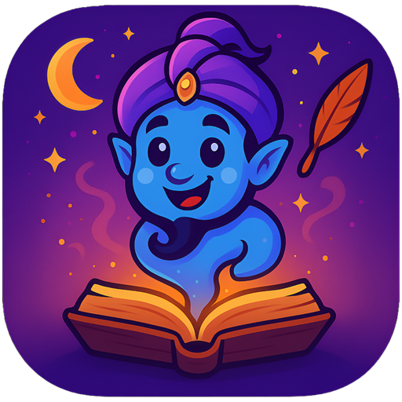
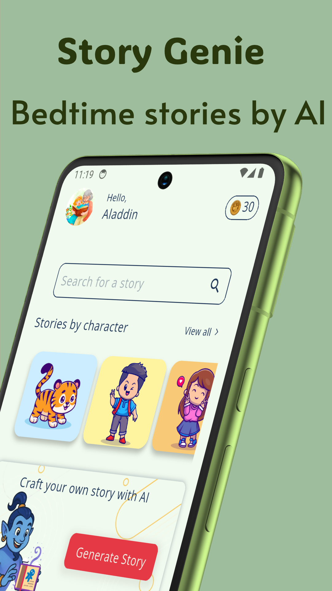
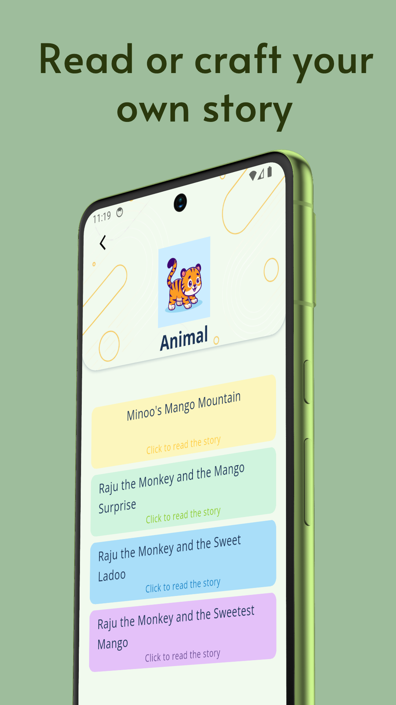
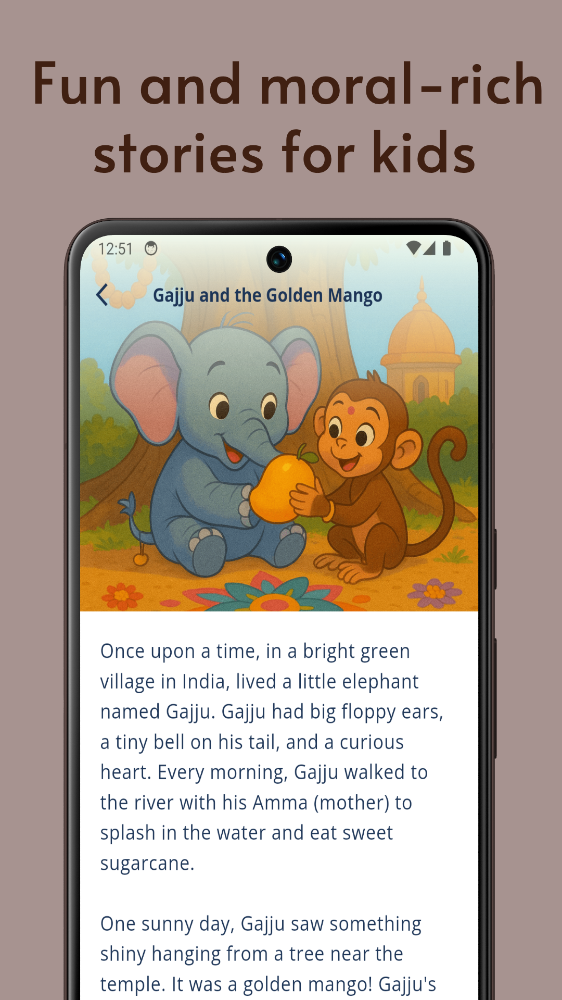
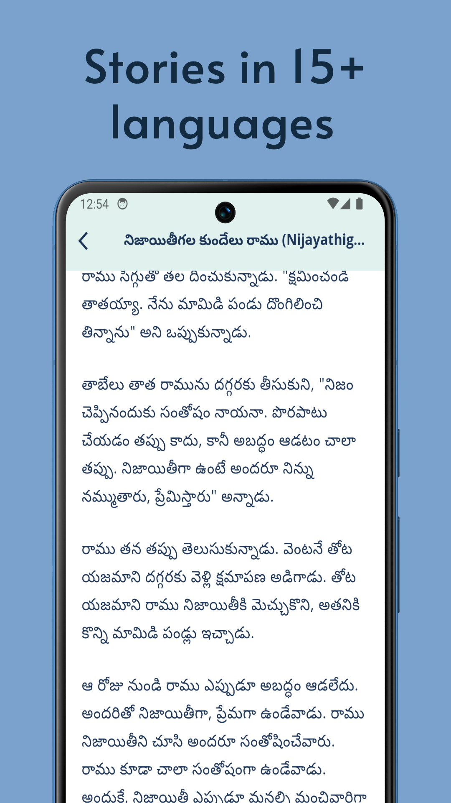
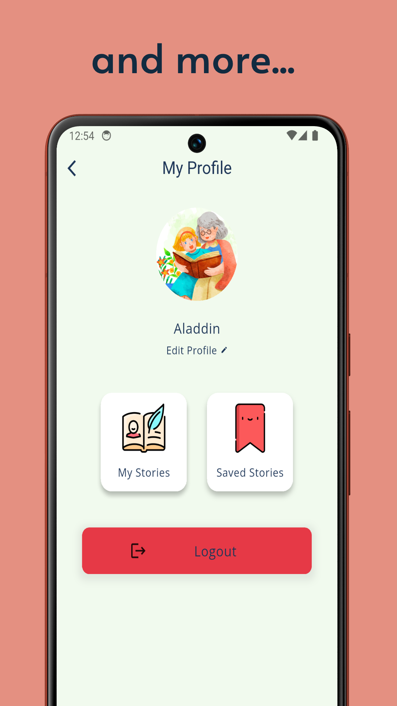

# 🧞 StoryGenie AI – Magical Bedtime Stories with the Power of AI

**StoryGenie AI** is a delightful Flutter-based app that generates personalized bedtime stories for kids using generative AI. Designed to inspire imagination, build reading habits, and teach moral values, StoryGenie lets parents and children co-create magical tales that are unique every time.

<div align="center">

</div>

---

## ✨ Features

- 🧠 **AI Story Generator** – Uses **Google Gemini API** to generate custom stories based on child’s age, gender, and theme.
- 🔍 **Smart Story Search** – Powered by **Algolia** for fast, fuzzy, and multilingual search capabilities.
- 📖 **Explore Stories** – Read stories generated by other users: Editor's Picks & Latest Stories.
- ❤️ **Save Favorites** – Bookmark your favorite stories for repeat bedtime reading.
- 🔗 **Social Sharing** – Easily share your favorite tales with family and friends.
- 🌍 **Multilingual Support** – Generate stories in 15+ languages including English, Hindi, Telugu, Tamil, Spanish, Mandarin, and more.

---

## 🛠 Tech Stack

- **Flutter** – Frontend & UI
- **Dart** – Programming Language
- **Google Gemini API** – Story content generation
- **Firebase** – Auth, database, and storage
- **Algolia** – Search indexing and filtering
- **Flutter Platter Starter Kit** – Boilerplate setup for scalable development

---

## 📱 Screenshots

<div align="center">
  
  
  
  
  

</div>
</br>
<div align="center">
  
  </br>
  [Download app from playstore] (https://play.google.com/apps/testing/com.flutterplatter.storygenie) - Closed Testing Link - email me for invite
  [Download apk from medifire] (https://www.mediafire.com/file/neu3agr0i56n0vc/storygenie-release.apk/file)
</div>

---

## 🛠️ Getting Started

```bash
# Clone the repository
git clone https://github.com/Rohith01/flutter_platter_story_genie.git
cd flutter_platter_story_genie

# initialize firebase
https://firebase.google.com/docs/flutter/setup?platform=android

# setup firebase db
https://firebase.google.com/docs/firestore/quickstart
create 

#Change following values
1. Package Name
2. Google Signin and Captcha Keys - kWebRecaptchaSiteKey and kGoogleSigninClientId at lib/core/constants.dart
3. Gemini API Key at lib/core/constants.dart
2. Algolia AppId and API Keys - kAlgoliaAppId and kAlgoliApiKey at lib/core/constants.dart. Get it from [https://www.algolia.com/]


# Get dependencies
flutter clean
flutter pub get

# Run the app
flutter run
```

---

## 🧩 Folder Structure

```
lib/
├── core/              # Error handling, utils, constants
├── presentation/      # Feature modules (auth, notifications, UI screens etc.)
├── services/          # Shared services (e.g., API, storage)
├── theme/             # App theming and UI config
├── main.dart          # App entry point
```

---

## 🤝 Contributing

We welcome contributions! Please see [CONTRIBUTING.md](CONTRIBUTING.md) for guidelines on how to get involved.

---

## 📄 License

This project is licensed under the MIT License. See the [LICENSE](LICENSE) file for details.

---

## 🌐 Connect

Have suggestions or want to collaborate?

- Raise an issue or PR
- Tweet using **#FlutterPlatter** **#StoryGenie**
- Drop a ⭐ if this helped you!

> Eat, code, and ship. 🧑‍🍳🚀
